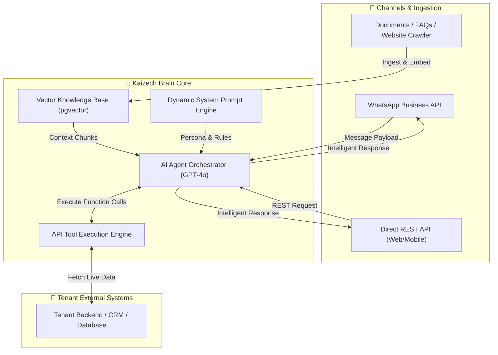
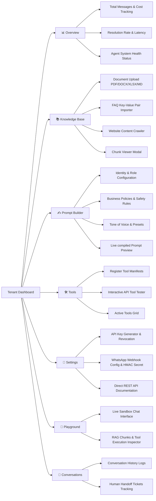

# Kaizech Brain — Tenant Onboarding & Integration Guide

Welcome to **Kaizech Brain**, an enterprise multi-tenant AI Agent platform designed to power intelligent, domain-specific AI Assistants across your communication channels (WhatsApp Business API, Web Applications, Mobile Apps, and internal systems).

This documentation is designed to guide new tenant organizations through setting up, configuring, training, and integrating your AI Assistant to deliver fast, accurate, and context-aware responses to your customers.

---

## Table of Contents

1. [Platform Overview & Key Features](#1-platform-overview--key-features)
2. [Dashboard Visual Walkthrough](#2-dashboard-visual-walkthrough)
3. [Teaching the Model: Knowledge Base & RAG](#3-teaching-the-model-knowledge-base--rag)
4. [Configuring AI Persona & Behavior: System Prompt Builder](#4-configuring-ai-persona--behavior-system-prompt-builder)
5. [Connecting Business Systems: Custom Tools & APIs](#5-connecting-business-systems-custom-tools--apis)
6. [Channel Integration Guide (WhatsApp & REST API)](#6-channel-integration-guide-whatsapp--rest-api)
7. [Testing, Debugging & Analytics](#7-testing-debugging--analytics)
8. [Best Practices for Maximum Answer Accuracy](#8-best-practices-for-maximum-answer-accuracy)
9. [Quick-Start Onboarding Checklist](#9-quick-start-onboarding-checklist)

---

## 1. Platform Overview & Key Features

Kaizech Brain combines **Retrieval-Augmented Generation (RAG)**, **Real-Time API Function Calling**, and **Dynamic Persona Building** into a unified customer interaction platform.



### Core Features Support Matrix

| Feature | Description | Support Level |
| :--- | :--- | :---: |
| **Multi-Channel Delivery** | Native support for WhatsApp Business API & REST API | ✅ Full |
| **Multi-Format Ingestion** | Upload `.pdf`, `.docx`, `.xlsx`, `.md`, FAQs, or crawl live websites | ✅ Full |
| **pgvector RAG Engine** | 1536-dimensional semantic similarity search for exact context matching | ✅ Full |
| **Real-time API Tool Calling**| Allow AI to trigger external APIs (e.g. fetch user profile, check inventory) | ✅ Full |
| **Structured Prompt Engine** | 10-block system prompt builder (Identity, Policies, Tone, Safety Rules) | ✅ Full |
| **Human Handoff / Tickets** | Automatic escalation management when queries require human agents | ✅ Full |
| **Token & Cost Tracking** | Real-time tracking of prompt/completion tokens and estimated USD costs | ✅ Full |
| **Interactive Playground** | Live sandbox with real-time RAG diagnostic logs & latency metrics | ✅ Full |

---

## 2. Dashboard Visual Walkthrough

Your tenant customer panel provides a unified control center for your AI Assistant. Below is an overview of each dashboard tab:

```
┌────────────────────────────────────────────────────────────────────────────────────────┐
│  🧠 KAIZECH BRAIN                [Overview] [Knowledge] [Prompt Builder] [Tools] ...   │
└────────────────────────────────────────────────────────────────────────────────────────┘
```

### Tab Overview & Functions



---

## 3. Teaching the Model: Knowledge Base & RAG

To ensure your AI Assistant delivers accurate, business-specific answers without hallucination, you must supply it with your organization's knowledge base.

### Supported Knowledge Formats

| Source Type | Accepted Formats / Inputs | Best Used For |
| :--- | :--- | :--- |
| **Documents** | `.pdf`, `.docx`, `.xlsx`, `.md` | Product manuals, company policies, terms of service, catalogs |
| **FAQ Imports** | Question & Answer pairs | Direct, high-frequency customer queries (e.g. shipping fees, return windows) |
| **Website Crawler**| Public Web Page URL (HTML) | Help center pages, landing pages, documentation sites |

---

### Step-by-Step: Adding Knowledge

#### 1. Uploading Documents
1. Navigate to the **Knowledge** tab in the dashboard.
2. Select **Upload Document**.
3. Drag & drop or select your document (`.pdf`, `.docx`, `.xlsx`, or `.md`).
4. Click **Upload & Process**.
> ℹ️ *The system automatically splits your document into optimized text chunks (1,000 characters) and generates 1536-dimensional vector embeddings for semantic search.*

#### 2. Adding FAQ Pairs
1. Go to **Knowledge** > **Add FAQ**.
2. Input the exact **Question** (e.g., *"What is your return policy?"*).
3. Input the comprehensive **Answer** (e.g., *"We offer a 30-day money-back guarantee on all unused items."*).
4. Assign a **Category** tag (e.g., `returns`, `billing`) for organization.
5. Click **Save FAQ**.

#### 3. Crawling Web Pages
1. Go to **Knowledge** > **Crawl Website**.
2. Enter the **Source Name** (e.g., `Main Help Center`).
3. Enter the full target **URL** (e.g., `https://example.com/help`).
4. Click **Start Crawling**.
> ℹ️ *Our crawler automatically strips headers, footers, scripts, and navigation markup to ingest clean body text into the vector index.*

---

### Inspecting Indexed Knowledge

To verify what the AI model has learned:
1. In the **Knowledge** tab, locate your indexed source in the table.
2. Click **View Chunks**.
3. A modal will display all extracted chunks, their chunk IDs (`#1`, `#2`), character length, and raw text.
4. Use the search bar inside the modal to test if key facts were properly captured.

```
┌────────────────────────────────────────────────────────┐
│ Chunk #1 (1,000 chars)                                 │
│ "Mrkoon offers online vehicle auctions across KSA..."  │
│ [Copy Text]                                            │
└────────────────────────────────────────────────────────┘
```

---

## 4. Configuring AI Persona & Behavior: System Prompt Builder

The **Prompt Builder** gives you precise control over how your AI communicates, what rules it enforces, and how strictly it adheres to your knowledge base.

### The 10-Block Prompt System

Our platform dynamically compiles your settings into a structured system prompt:

1. **System Identity**: Define who the AI is (e.g., *"You are Mrkoon Assistant, an expert advisor for online auctions."*).
2. **Business Rules**: Operational policies (e.g., working hours, payment methods, auction bidding rules).
3. **Safety & Compliance**: Explicit guardrails (e.g., *"Never reveal customer OTPs, passwords, or personal banking info."*).
4. **Tone of Voice**: Personality guidelines (e.g. Professional, friendly, empathetic, concise).
5. **Special Instructions**: Language guidelines, bullet point rules, or call-to-action formats.
6. **Retrieved Knowledge (RAG)**: Automatically injected relevant chunks matching the user's inquiry.
7. **User Profile**: Injected end-user preferences and conversation history.

---

### Quick Templates

The Prompt Builder includes pre-configured presets:
* **Mrkoon Auction Assistant**: Optimized for auction platforms, bidding rules, and customer support.
* **Customer Support Bot**: Focused on ticket resolution, policy explanations, and friendly guidance.
* **E-Commerce Sales Advisor**: Tailored for product recommendations, inventory inquiries, and upsells.

---

## 5. Connecting Business Systems: Custom Tools & APIs

Custom Tools allow your AI Agent to execute actions in real time on your existing backend—such as retrieving a user's account balance, checking auction status, or creating a support ticket.

### Tool Architecture

```
User Message: "What is the status of my order #12345?"
  ↓
AI Agent identifies required Tool: `getOrderStatus(orderId: "12345")`
  ↓
Kaizech Brain sends HTTP POST/GET to Tenant API: `https://api.yourdomain.com/orders/12345`
  ↓
Tenant API returns JSON: `{ "status": "Shipped", "tracking": "XYZ987" }`
  ↓
AI Agent formulates answer: "Your order #12345 has been shipped. Tracking number is XYZ987."
```

---

### Registering a New Tool Manifest

1. Go to the **Tools** tab in the dashboard.
2. Click **Add New Tool**.
3. Complete the tool specification:
   * **Function Name**: Clean camelCase string without spaces (e.g., `getUserInfo`, `getAuctionDetails`).
   * **Description**: Explain clearly *when* the LLM should invoke this tool (e.g., *"Use this tool to fetch user profile details given their user ID."*).
   * **Target Endpoint URL**: Full HTTPS endpoint (e.g., `https://api.yourcompany.com/v1/users/info`).
   * **HTTP Method**: Select `GET`, `POST`, `PUT`, or `DELETE`.
   * **Authentication**: Configure `None`, `API Key`, or `Bearer Token` headers.
   * **Parameters Schema**: Define accepted JSON arguments:

```json
{
  "type": "object",
  "properties": {
    "userId": {
      "type": "string",
      "description": "Unique identifier of the customer"
    }
  },
  "required": ["userId"]
}
```

---

### Testing Tools Interactively

Before deploying a tool live:
1. In the **Tools** tab, locate **Interactive Tool Tester**.
2. Select your registered tool from the dropdown.
3. Click **Auto-fill Sample Payload** to generate sample arguments based on your schema.
4. Click **Execute Tool Call**.
5. Inspect the raw execution response JSON to ensure your API returns valid data.

---

## 6. Channel Integration Guide (WhatsApp & REST API)

Kaizech Brain supports simultaneous deployment across **Meta WhatsApp Business** and **Direct REST API**.

---

### Option A: WhatsApp Business API Integration

Connect your AI Agent directly to Meta's WhatsApp Cloud API.

```
WhatsApp User ──► Meta Cloud ──► POST /api/v1/channels/whatsapp/webhook/:tenantId ──► Kaizech Brain Agent
                                                                                              │
WhatsApp User ◄── Meta Graph API ◄── Bearer Token Response ──────────────────────────────────┘
```

#### Step-by-Step Setup:
1. Obtain your **Meta WhatsApp Business Account** details from [Meta for Developers](https://developers.facebook.com/).
2. In the Kaizech Brain Dashboard, go to **Settings** > **WhatsApp Integration**.
3. Copy your unique **Webhook Callback URL**:
   `https://your-brain-domain.com/api/v1/channels/whatsapp/webhook/<YOUR_TENANT_ID>`
4. Copy your **Verify Token** from the dashboard.
5. In Meta Developer Portal:
   * Paste the Webhook Callback URL and Verify Token.
   * Click **Verify and Save**.
   * Subscribe to the `messages` webhook field.
6. Enter your **Meta App Secret** in Kaizech Brain Settings to enable secure **HMAC SHA-256 (`X-Hub-Signature-256`) signature validation**.

---

### Option B: Direct REST API Integration

Integrate your web application, mobile app, or backend service directly using our REST API.

#### Authentication Header
All requests must include your tenant's API key:
```http
x-api-key: kb_live_your_secret_api_key_here
```

> ⚠️ *Keep your API key secure. Never expose it in client-side public code repositories.*

#### Endpoint Specification

* **URL**: `POST https://your-brain-domain.com/api/v1/channels/chat`
* **Content-Type**: `application/json`

#### Request Body
```json
{
  "message": "What are your operating hours?",
  "sessionId": "user_session_98765",
  "channelUserId": "+966500000000",
  "channelType": "api",
  "metadata": {
    "userName": "John Doe",
    "preferredLanguage": "en"
  }
}
```

#### Response Payload (`200 OK`)
```json
{
  "reply": "Our operating hours are Sunday through Thursday, 9:00 AM to 6:00 PM (AST).",
  "sessionId": "user_session_98765",
  "conversationId": "8f1a2b3c-4d5e-6f7a-8b9c-0d1e2f3a4b5c",
  "tenantId": "c39e248b-821a-4d7a-8b1e-089a85012345",
  "status": "active",
  "handedOff": false,
  "tokens": 170
}
```

> 💡 **Handoff Response Payload**: If an automated handoff rule is triggered (e.g. user asks for human agent, RAG search finds 0 results, AI is uncertain, or message limit reached), `status` will return `"handed_off"` and `handedOff` will be `true`:
```json
{
  "reply": "⚠️ Escalation requested by user. AI chat stopped and handed off to human support.",
  "sessionId": "user_session_98765",
  "conversationId": "8f1a2b3c-4d5e-6f7a-8b9c-0d1e2f3a4b5c",
  "status": "handed_off",
  "handedOff": true,
  "limitExceeded": false
}
```

---

#### Client-Initiated Handoff API Endpoint

Client applications (web chat widgets, mobile apps, or CRM bridges) can explicitly pause AI and trigger human handoff at any point.

* **URL**: `POST https://your-brain-domain.com/api/v1/channels/handoff`
* **Headers**: `x-api-key: kb_live_your_secret_api_key_here`, `Content-Type: application/json`

##### Request Body
```json
{
  "sessionId": "user_session_98765",
  "reason": "client_button_clicked",
  "notice": "Customer requested human support via mobile app."
}
```

##### Response Payload (`200 OK`)
```json
{
  "success": true,
  "message": "Conversation paused and handed off to human support.",
  "conversationId": "8f1a2b3c-4d5e-6f7a-8b9c-0d1e2f3a4b5c",
  "sessionId": "user_session_98765",
  "tenantId": "c39e248b-821a-4d7a-8b1e-089a85012345",
  "status": "handed_off",
  "handedOff": true,
  "reason": "client_button_clicked"
}
```

#### Integration Code Examples

##### cURL (Send Message)
```bash
curl -X POST "https://your-brain-domain.com/api/v1/channels/chat" \
  -H "Content-Type: application/json" \
  -H "x-api-key: kb_live_your_secret_api_key_here" \
  -d '{
    "message": "Hello, how can I place a bid?",
    "sessionId": "session_123"
  }'
```

##### cURL (Trigger Human Handoff)
```bash
curl -X POST "https://your-brain-domain.com/api/v1/channels/handoff" \
  -H "Content-Type: application/json" \
  -H "x-api-key: kb_live_your_secret_api_key_here" \
  -d '{
    "sessionId": "session_123",
    "reason": "user_requested_agent"
  }'
```

##### JavaScript / Node.js
```javascript
// Check if response returned handedOff === true
const response = await fetch("https://your-brain-domain.com/api/v1/channels/chat", {
  method: "POST",
  headers: {
    "Content-Type": "application/json",
    "x-api-key": "kb_live_your_secret_api_key_here"
  },
  body: JSON.stringify({
    message: "Talk to human agent please",
    sessionId: "session_123"
  })
});

const data = await response.json();
if (data.handedOff || data.status === 'handed_off') {
  console.log("Conversation is handed off to human support:", data.reply);
  // Transfer user to live human chat widget
}
```

##### Python
```python
import requests

url = "https://your-brain-domain.com/api/v1/channels/chat"
headers = {
    "Content-Type": "application/json",
    "x-api-key": "kb_live_your_secret_api_key_here"
}
payload = {
    "message": "Hello, how can I place a bid?",
    "sessionId": "session_123"
}

response = requests.post(url, json=payload, headers=headers).json()
if response.get("handedOff"):
    print("AI handed off to human support:", response["reply"])
else:
    print("Agent Response:", response["reply"])
```

---

## 7. Testing, Debugging & Analytics

### Interactive AI Playground

The **Playground** tab allows you to test your bot in real time before going live to customers.

```
┌──────────────────────────────────────┬─────────────────────────────────────────┐
│ Live Chat Sandbox                    │ Execution Diagnostics                   │
│                                      │                                         │
│ User: What is the auction deposit?   │ ⏱️ Latency: 640ms                      │
│                                      │ 📚 Chunks Retrieved: 3                   │
│ Bot: The deposit requirement is 20%  │ 🛠️ Tools Called: getAuctionRules        │
│ of the starting bid value.           │ 📊 Prompt Tokens: 310                   │
│                                      │ 📊 Completion Tokens: 24                │
└──────────────────────────────────────┴─────────────────────────────────────────┘
```

#### Diagnostic Metrics Displayed:
* **Latency (ms)**: Total round-trip response generation time.
* **Retrieved Chunks**: Exact text snippets pulled from vector search to answer the prompt.
* **Tool Executions**: Shows API function called, inputs passed, and JSON outputs returned.
* **Token Breakdown**: Displays exact token count consumed for cost management.

---

### Analytics & Cost Monitoring

The **Overview** tab provides real-time operational insights:

* **Resolution Rate**: Percentage of customer conversations successfully handled by the AI without requiring human handoff.
* **Average Response Time**: Performance latency across all channels.
* **Token Consumption**: Detailed breakdown of Input (Prompt) vs Output (Completion) tokens.
* **Estimated Cost (USD)**: Calculated based on standard model pricing ($2.50 per 1M prompt tokens, $10.00 per 1M completion tokens).

---

## 8. Best Practices for Maximum Answer Accuracy

To guarantee your AI model provides accurate responses and avoids mistakes:

### 1. Document Preparation Guidelines
* **Keep Documents Structured**: Use clear headings, bullet points, and plain language.
* **Avoid Image-Only PDFs**: Ensure PDFs contain selectable text. Scanned images cannot be indexed without OCR.
* **Use FAQ Pairs for Critical Facts**: For exact prices, phone numbers, or refund policies, explicitly add them as FAQ pairs—FAQ items have high precision in semantic search.

### 2. Prompt Engineering Guidelines
* **Set Explicit Fallbacks**: Instruct the model what to say when data is missing:
  > *"If the answer is not present in the retrieved knowledge base, respond politely stating that you do not have that specific detail, and offer to transfer the user to a customer service agent."*
* **Restrict Speculation**:
  > *"Do not invent or guess prices, dates, or terms that are not explicitly documented in the knowledge base."*

### 3. API Tool Best Practices
* **Provide Detailed Parameter Descriptions**: Explain clearly what format expected fields require (e.g. `YYYY-MM-DD` for dates, phone number with country code).
* **Return Clean JSON Responses**: Keep backend tool API outputs concise. Filter out unnecessary debugging metadata to conserve token context.

---

## 9. Quick-Start Onboarding Checklist

Follow this checklist to get your AI Agent fully operational:

- [ ] **Step 1: Account Setup**
  - Obtain tenant access credentials.
  - Generate your secret **API Key** in the **Settings** tab.

- [ ] **Step 2: Knowledge Ingestion**
  - Upload core company documentation (`.pdf`, `.docx`, `.md`).
  - Import high-frequency Q&A pairs via **FAQ Importer**.
  - Crawl main support web pages.
  - Verify chunk quality in **Knowledge** > **View Chunks**.

- [ ] **Step 3: Persona & Prompt Builder**
  - Configure Identity, Business Rules, Safety Constraints, and Tone of Voice.
  - Set fallback rules to prevent hallucinations.
  - Save system prompt configuration.

- [ ] **Step 4: Custom API Tools (Optional)**
  - Register API tool manifests for backend system integrations.
  - Verify endpoints using the **Interactive Tool Tester**.

- [ ] **Step 5: Playground Testing**
  - Test diverse user queries in the **Playground**.
  - Inspect retrieved chunks and execution latency.

- [ ] **Step 6: Channel Deployment**
  - Configure WhatsApp Business Webhook & Meta App Secret (for WhatsApp).
  - Integrate REST API (`POST /api/v1/channels/chat`) into your application.

---

*Kaizech Brain Platform Documentation — Version 1.0*
